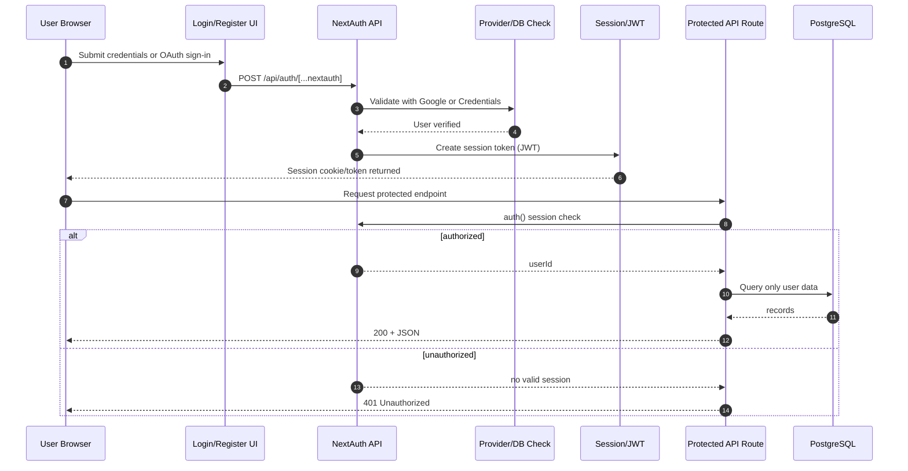
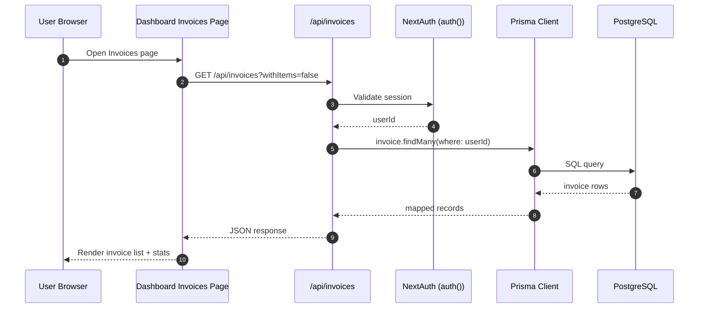
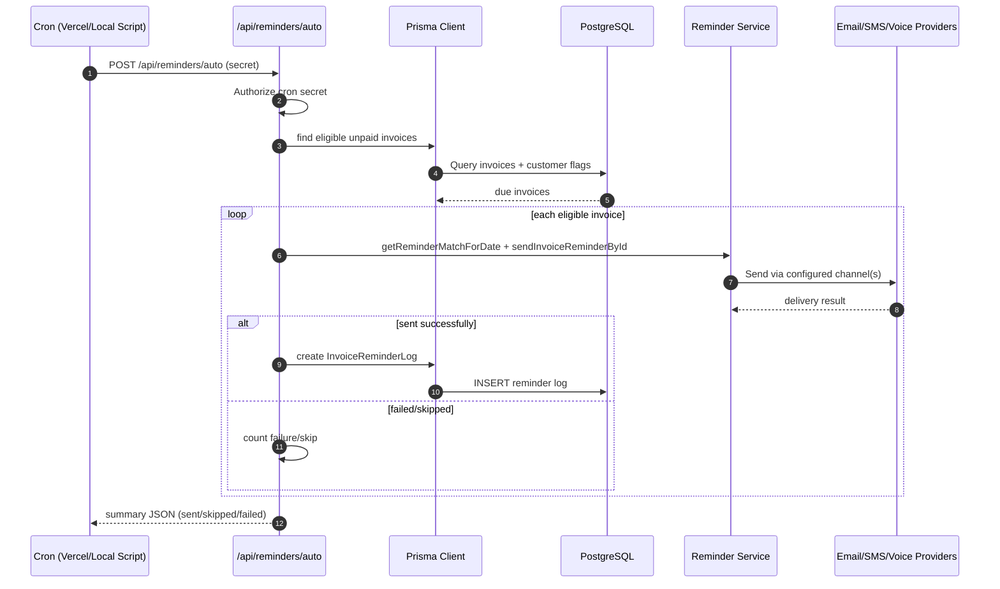

# InvoiceFlow - Advanced B2B Invoice Management

A full-stack invoice management system for creating invoices, tracking payments, running analytics, and automating reminders across email/SMS/voice channels.

## Table of Contents
1. Overview
2. Key Features
3. Architecture at a Glance
4. Tech Stack
5. Project Structure
6. Prerequisites
7. Environment Variables
8. Local Setup
9. Database Setup and Migrations
10. Running the App
11. Reminder Automation (Local and Cloud)
12. API Surface
13. Security Model
14. Performance Guidelines
15. Troubleshooting
16. Documentation Map
17. License

## 1. Overview
- Frontend: Next.js App Router pages and client components.
- Backend: Next.js route handlers under `app/api/**/route.ts`.
- Data: PostgreSQL via Prisma ORM.
- Auth: NextAuth v5 with Google OAuth and Credentials.
- Automation: daily reminder sweep via Vercel Cron or Windows Task Scheduler.

This repository already contains backend functionality. A separate backend service is not required for normal scaling at current scope.

## 2. Key Features
- Professional invoice create/read/update/delete lifecycle.
- PDF invoice generation and mail delivery.
- Automated reminders with idempotent reminder logs.
- Multi-channel delivery support (email, SMS, voice, Telegram mirror).
- Dashboard analytics for KPIs, revenue trend, and risk insights.
- Bulk imports for invoices and customers (YAML/Tally-oriented flows).

## 3. Architecture at a Glance
```mermaid
flowchart LR
	U[User Browser] --> FE[Next.js Frontend\napp/**/page.tsx]
	FE --> API[Next.js Backend APIs\napp/api/**/route.ts]
	API --> AUTH[NextAuth\nlib/auth.ts]
	API --> PRISMA[Prisma Client\nlib/db.ts]
	PRISMA --> DB[(PostgreSQL)]
	API --> CH[Email / SMS / Voice / Telegram]
	CRON[Vercel Cron or Task Scheduler] --> RA[/api/reminders/auto]
```

### 3.1 Authentication and Authorization Flow


### 3.2 Invoice List Request Flow


### 3.3 Automated Reminder Flow


### 3.4 Deployment and Scheduling Flow
```mermaid
flowchart LR
	subgraph Cloud[Cloud Runtime]
		V[Vercel Deployment]
		VC[Vercel Cron\n0 9 * * *]
		AR[/api/reminders/auto]
	end

	subgraph Local[Local Runtime]
		TS[Windows Task Scheduler]
		BAT[scripts/run-reminders.bat]
		JS[scripts/run-reminders.js]
		ARL[/api/reminders/auto]
	end

	DB[(PostgreSQL)]
	CH[Email/SMS/Voice Channels]

	VC --> AR
	TS --> BAT --> JS --> ARL
	AR --> DB
	ARL --> DB
	AR --> CH
	ARL --> CH
```

For full diagrams, see `SYSTEM_ARCHITECTURE_DIAGRAM.md`.
For complete architecture narrative, see `system architecture.md`.

## 4. Tech Stack
- Framework: Next.js 16.x (App Router)
- Runtime: Node.js
- UI: React 19, Tailwind CSS, Radix/Shadcn components
- Data: Prisma 5 + PostgreSQL
- Authentication: next-auth v5
- Notifications: Gmail API/SMTP, Telegram, (SMS/Voice Coming Soon)
- Charts and reporting: Recharts

## 5. Project Structure
```text
app/                 Next.js pages and API routes
app/api/             Backend route handlers
components/          Shared UI components
lib/                 Auth, DB, reminders, messaging, PDF, helpers
prisma/              Schema and migrations
scripts/             Operational scripts (cron trigger, setup helpers)
logs/                Runtime logs (local reminder scheduler)
data/                Bulk import sample files
Documentataion/      Additional project docs (SRS, etc.)
```

## 6. Prerequisites
- Node.js 18.17+
- npm or pnpm
- PostgreSQL database
- Optional provider accounts: Google, Twilio, Telegram, VAPI

## 7. Environment Variables
Create `.env` in repository root.

### Core
```env
DATABASE_URL="postgresql://<user>:<password>@<host>:<port>/<db>?schema=public"
DIRECT_URL="postgresql://<user>:<password>@<host>:<port>/<db>?schema=public"
AUTH_SECRET="replace-with-strong-random-secret"
SITE_URL="http://localhost:3000"
```

### Authentication
```env
GOOGLE_CLIENT_ID="..."
GOOGLE_CLIENT_SECRET="..."
```

### Email (choose according to current integration path)
```env
GMAIL_USER="your-email@gmail.com"
GMAIL_APP_PASSWORD="your-app-password"
```

### SMS
```env
TWILIO_ACCOUNT_SID="..."
TWILIO_AUTH_TOKEN="..."
TWILIO_PHONE_NUMBER="+1..."
```

### Telegram (optional mirror notifications)
```env
TELEGRAM_BOT_TOKEN="..."
TELEGRAM_CHAT_ID="..."
```

### Voice (optional)
```env
# Voice Reminders (Future Update)
# VAPI_API_KEY="..."
# VAPI_PHONE_NUMBER_ID="..."
# VAPI_ASSISTANT_ID="..."
SARVAM_API_KEY="..."
```

### Cron Security
```env
REMINDER_CRON_SECRET="set-a-long-random-value"
# Optional alias used by some scripts
CRON_SECRET="same-or-different-random-value"
```

## 8. Local Setup
```bash
npm install
npx prisma generate
npx prisma migrate deploy
npm run dev
```

pnpm alternative:
```bash
pnpm install
pnpm prisma generate
pnpm prisma migrate deploy
pnpm dev
```

If you are starting from a clean local DB and want schema sync quickly:
```bash
npx prisma db push
```

## 9. Database Setup and Migrations
- Schema source of truth: `prisma/schema.prisma`
- Migration files: `prisma/migrations/**`
- Generate Prisma client after schema changes:
```bash
npx prisma generate
```

## 10. Running the App
- Dev server:
```bash
npm run dev
```
- Build:
```bash
npm run build
```
- Production start:
```bash
npm run start
```

## 11. Reminder Automation (Local and Cloud)
### Cloud (Vercel)
- `vercel.json` triggers `/api/reminders/auto` daily.
- Set `CRON_SECRET` in Vercel Project Environment Variables (important: Vercel cron uses this name for bearer auth).
- Keep `REMINDER_CRON_SECRET` only as optional compatibility alias in your app.
- After changing env vars, redeploy the project.

### Local (Windows Task Scheduler)
- Launcher: `scripts/run-reminders.bat`
- Script: `scripts/run-reminders.js`
- Logs: `logs/reminder-cron.log`
- Ensure target URL is reachable when scheduler runs:
	- Set `REMINDER_TARGET_URL` (or `SITE_URL`) to your live app URL, or
	- Keep localhost and ensure Next.js server is running at schedule time.

Manual test run:
```bash
node --env-file=.env scripts/run-reminders.js
```

## 12. API Surface
Representative route groups:
- Auth: `app/api/auth/[...nextauth]/route.ts`
- Dashboard: `app/api/dashboard/stats/route.ts`
- Invoices: `app/api/invoices/route.ts`, `app/api/invoices/[id]/route.ts`
- Customers: `app/api/customers/route.ts`
- Products: `app/api/products/route.ts`
- Payments: `app/api/payments/route.ts`
- Reminders: `app/api/reminders/auto/route.ts`, `app/api/reminders/send/route.ts`
- Integrations: OCR, SMS, voice, TTS endpoints under `app/api/**`

## 13. Security Model
- Protected dashboard routes via `middleware.ts` matcher.
- API-level auth checks with `auth()` in route handlers.
- User-scoped queries in invoice/dashboard endpoints.
- Secret-based authorization for cron-triggered reminder sweep.

## 14. Performance Guidelines
Apply these before considering a separate backend service:
1. Prefer server-side data loading for heavy dashboard views.
2. Use endpoint caching/revalidation where appropriate.
3. Paginate large invoice lists and avoid over-fetching fields.
4. Keep indexes aligned with real filters (`userId`, `status`, `dueDate`).
5. Move long-running work to background execution paths.
6. Monitor slow queries and p95 endpoint latency.

## 15. Troubleshooting
### App fails to start
- Verify Node version: `node -v`
- Reinstall dependencies: `npm install`
- Confirm `.env` values are present.

### Prisma errors
- Regenerate client: `npx prisma generate`
- Apply migrations: `npx prisma migrate deploy`
- Verify DB connectivity in `DATABASE_URL`.

### Reminders not triggering
- Check `REMINDER_CRON_SECRET` and `CRON_SECRET` values.
- Confirm scheduler invokes `scripts/run-reminders.bat`.
- Inspect `logs/reminder-cron.log`.
- Test endpoint manually via script command above.
- If you see `ECONNREFUSED`, your target URL is down/unreachable at runtime.
- If you see `401 Unauthorized` from Vercel cron, set `CRON_SECRET` in Vercel and redeploy.

### SMS or voice failures
- Validate Twilio/VAPI environment variables.
- Check provider account status and sender number permissions.

## 16. Documentation Map
- Main architecture narrative: `system architecture.md`
- Detailed diagrams: `SYSTEM_ARCHITECTURE_DIAGRAM.md`
- Product/system requirements: `Documentataion/SRS.md`

## 17. License
Project developed for B2B Invoice Management. All rights reserved.
