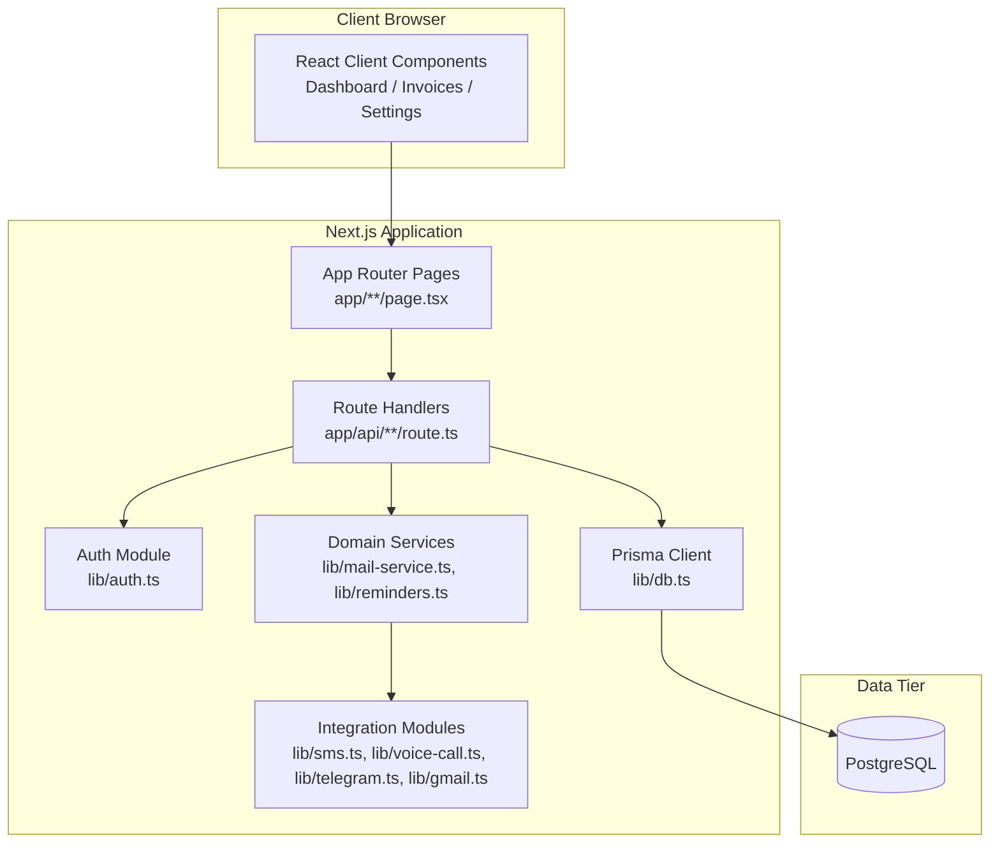
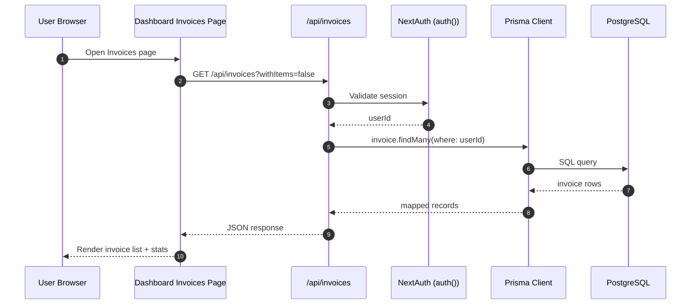
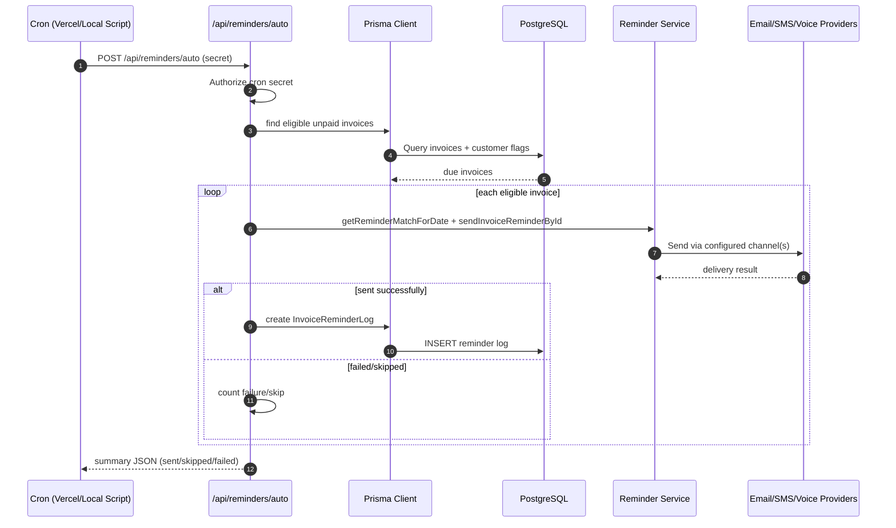
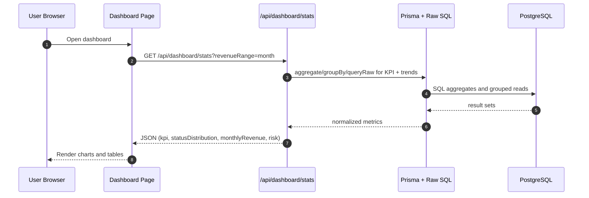
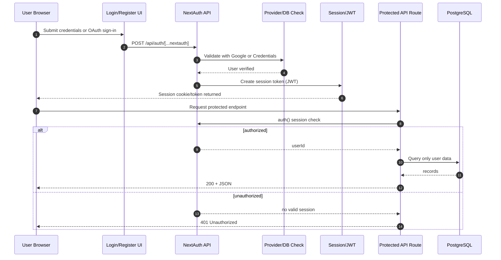

# System Architecture Diagrams

## 1. System Context
Description: This context diagram shows external actors and services around the core app. It highlights who uses the system, where backend APIs sit, and which third-party providers are integrated.

```mermaid
flowchart LR
    USER[Business User\nAdmin / Staff] --> WEB[Invoice Management Web App\nNext.js Frontend]

    WEB --> API[Next.js Backend APIs\napp/api/**]
    API --> DB[(PostgreSQL)]

    API --> GOOGLE[Google OAuth / Gmail API]
    API --> TWILIO[Twilio SMS]
    API --> Gmail[Gmail API/Email]
    API --> TELEGRAM[Telegram Bot API]
    API --> OCR[OCR Service]

    CRON[Vercel Cron / Windows Task Scheduler] --> AUTO[/api/reminders/auto]
```

## 2. Container Diagram
Description: This container-level diagram breaks the app into runtime building blocks. It shows how browser UI, Next.js pages/routes, domain services, integrations, and the database connect.



## 3. Invoice List Request Flow
Description: This sequence diagram explains the read path for invoice listing. It covers browser fetch, API auth validation, Prisma query execution, and JSON response rendering.



## 4. Automated Reminder Flow
Description: This sequence diagram captures the scheduled reminder pipeline. It includes cron trigger, authorization, invoice eligibility checks, channel dispatch, and idempotent logging.



## 5. Dashboard Analytics Flow
Description: This sequence diagram shows how dashboard KPIs and charts are assembled. It maps the request from UI to analytics endpoint, aggregate queries, and final payload delivery.



## 6. Authentication and Authorization Flow
Description: This sequence diagram shows login and protected API access. It includes NextAuth session creation and route-level authorization checks before data queries.



## 7. Deployment and Scheduling Flow
Description: This runtime diagram explains how app hosting and reminder scheduling work in cloud and local modes, including secret-protected cron triggering.

```mermaid
flowchart LR
    subgraph Cloud[Cloud Runtime]
        V[Vercel Deployment]
        VC[Vercel Cron\n0 9 * * *]
        AR[/api/reminders/auto]
    end

    subgraph Local[Local Runtime]
        TS[Windows Task Scheduler]
        BAT[scripts/run-reminders.bat]
        JS[scripts/run-reminders.js]
        ARL[/api/reminders/auto]
    end

    DB[(PostgreSQL)]
    CH[Email/SMS/Voice Channels]

    VC --> AR
    TS --> BAT --> JS --> ARL
    AR --> DB
    ARL --> DB
    AR --> CH
    ARL --> CH
```

## Notes
- This project already includes backend capabilities inside Next.js Route Handlers.
- For speed improvements, optimize query patterns, caching, payload size, and server rendering strategy before introducing a separate backend service.

## Document Usage
- Use `system architecture.md` for full written architecture, decisions, and optimization plan.
- Use `SYSTEM_ARCHITECTURE_DIAGRAM.md` for visual communication in reviews, presentations, and onboarding.
